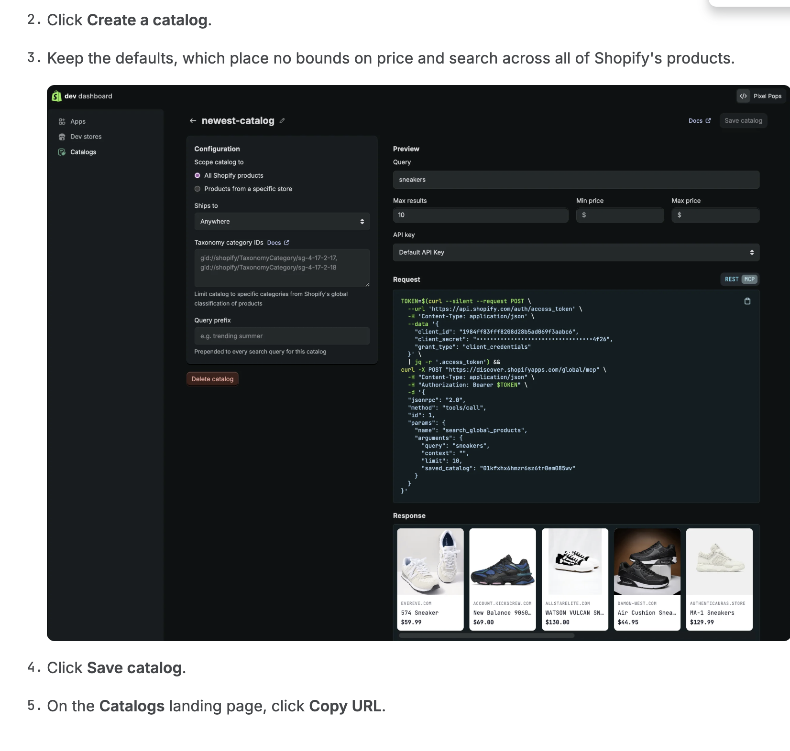

# ucp-cli — End-to-end walkthrough of Shopify's Agents Get Started tutorial

A working reproduction of the [Shopify Agents Get Started](https://shopify.dev/docs/agents)
tutorial (auth → profile → catalog search → product details → cart → checkout
→ order monitoring) — plus a documented list of every place the published
Node samples failed against the live MCP server during a literal copy-paste
attempt, with proposed fixes for the docs team.

**Live agent profile:** https://ucp-profiles.vercel.app/profiles/ucp-demo-agent.json

**Status:** Steps 1–6 (auth, profile, search, product details, cart, checkout)
working end-to-end against `the-shirt.com`'s per-merchant MCP. Step 7
(order monitoring) blocked on `read_global_api_orders` scope — the Dev
Dashboard's Catalogs-API-key UI has no documented path to grant it.

**📺 Video walkthrough:** [Building an AI Shopping Agent on Shopify — UCP End-to-End Walkthrough](https://youtu.be/fKhMA2QvReo)

[](https://youtu.be/fKhMA2QvReo)

## TL;DR for the team that built this

Every Node sample in the Get Started series **fails on a literal first run**.
Every divergence below is documented inline in this README with reproduction
steps and the exact server error that led to its discovery.

**Headline findings** (full detail later in this doc):

1. **The catalog URL the tutorial tells you to copy is the wrong one.** The
   Dev Dashboard's `Copy URL` button on the Catalogs landing page returns the
   **REST** URL, while every subsequent code sample assumes the **MCP**
   endpoint. The MCP URL is only surfaced by a hidden `REST / MCP` toggle in
   the catalog editor's Request panel. → [Root cause section](#root-cause-of-the-url-divergence)
2. **Steps 3 and 4 silently switch API surfaces** — global MCP
   (`discover.shopifyapps.com/global/mcp`) for cross-merchant catalog search
   vs. per-merchant MCP (discovered via `/.well-known/ucp`) for
   cart/checkout/order. Tool names, argument shapes, profile requirements,
   and response wrappers all differ. The tutorial doesn't disambiguate.
3. **`search_catalog` doesn't exist on the global endpoint** the tutorial
   sends the request to. Server returns `-32602 / Tool not found`. The actual
   tool is `search_global_products` (visible only in the dashboard's MCP
   sample); `search_catalog` is a *per-merchant* tool. → [Divergences table](#divergences-from-the-official-tutorial)
4. **The tutorial's argument shape is rejected by the live schema.**
   Published: `arguments: { meta, catalog: { query, filters } }`. Schema:
   flat `{ query, context, limit, saved_catalog, include_secondhand,
   min_price, max_price, ships_to }`. Filter field names also differ
   (e.g. `condition: ['secondhand']` → `include_secondhand: true`).
5. **The response wrapper documented in the tutorial doesn't exist.**
   Tutorial reads `result.structuredContent.products[]`; the server returns
   the payload as a JSON-encoded **string** at `result.content[0].text`
   that requires a second `JSON.parse` and is keyed `offers` (not `products`).
6. **The buyer-IP transport contradicts the UCP overview spec.** Spec
   defines it as a body signal at `arguments.signals['dev.ucp.buyer_ip']`;
   Shopify's per-merchant MCP silently ignores the body and rejects with
   "Missing required buyer IP header" until you send `Shopify-Buyer-IP`
   as an HTTP header. → [Per-merchant divergences](#per-merchant-mcp-divergences-cart--checkout-steps)
7. **`create_checkout` requires `checkout.line_items` even when `cart_id`
   is provided**, despite the docs saying `cart_id` alone is sufficient and
   "inherits line items, context, and buyer from the cart."
8. **The auth tutorial produces a credential class that can't reach Step 7.**
   Order MCP requires `read_global_api_orders` scope; the Dev Dashboard's
   Catalogs-API-key UI exposes no scope-management controls at all.

**What we'd love from the docs / agents team:**

- Change `Copy URL` on the Catalogs landing page to copy the **MCP** URL
  (since that's what every code sample below it expects), or add an explicit
  "now switch to the MCP tab and copy that URL instead" instruction step.
- Disambiguate global-MCP vs. per-merchant-MCP explicitly on the
  search-catalog and build-a-cart pages — preferably with a one-paragraph
  intro that names both surfaces and links to the relevant schemas.
- Update the Node sample on the search-catalog page to match the live tool
  name (`search_global_products`), arg shape, response wrapper, and field
  names (camelCase, no nested `filters` object).
- Add the `Shopify-Buyer-IP` header to every cart/checkout/order Node sample
  and document where to source the buyer's IP from. The header is currently
  missing from every published example.
- Clarify in the checkout tutorial that `cart_id` and `checkout.line_items`
  are both required — not alternative paths. The current "primary argument:
  cart_id" language implies sufficiency, which the live schema contradicts.
- Document the path from "follow the auth tutorial" to "have a credential
  with `read_global_api_orders` scope" — currently there is none reachable
  from the Catalogs-API-key UI.

The reproduction steps and every divergence in detail are below. The
walkthrough is captured chronologically in our commit history at
https://github.com/dzuluaga/shopify-ucp-getting-started/commits/main.

## Looking forward — beyond the terminal REPL

The Get Started series does a great job of teaching UCP's mechanics
end-to-end via a Node.js terminal script — and that's the foundation
this repo's demo is built on. As a developer evaluating the platform,
though, what we'd love to see published alongside the existing tutorial
is **a real agent UI demoing the same flow with product imagery,
variant pickers, cart state, and checkout transitions rendered
visually**.

A useful analogy: the web's adoption didn't take off when HTTP and HTML
were finalized — it took off when Mosaic and Netscape rendered those
documents with images and rich layout. The terminal was always
technically capable of speaking HTTP; what changed the adoption curve
was the *visual* demonstration of what the protocol made possible.
Agentic commerce sits at a similar inflection: the protocol is clean
and shipping, but the discovery surface today is mostly Node samples
that print product titles to a console.

**The kind of experience that would massively accelerate developer
imagination** — an agent that visibly browses catalogs, filters by
attributes, displays product cards with imagery, walks the buyer
through option selection, and hands off to checkout with cart state
always in view:

[](https://www.youtube.com/watch?v=84sqk0sP2Rk)

Even a small Shopify-hosted reference frontend that consumes the same
MCP tools this repo demonstrates — or a partnership with one of the
frontier LLM clients to ship a visible UCP rendering surface — would,
in our view, do more for adoption than any number of additional
terminal-based tutorials. We're rooting for that next chapter, and
happy to keep contributing divergence reports and working demo code
in the meantime.

## What this is

UCP requires an agent to publish a JSON **profile** declaring which capabilities
it speaks (cart, checkout, etc.). The profile URL is passed on every request
via `meta.ucp-agent.profile`, and Shopify uses it for capability negotiation,
rate-limit tiering, and signed-request verification.

This repo:

- Hosts the smallest valid profile (cart + checkout capabilities) as a static
  JSON file on Vercel.
- Includes `ucp_demo.js`, a Node 22+ script that walks the buyer journey from
  auth through cart, checkout, and a referral URL: authenticates against
  Shopify's token endpoint, calls `search_global_products` against a saved
  catalog, lets the user pick a product/variant via `get_global_product_details`,
  then discovers the merchant's MCP endpoint via `/.well-known/ucp` and
  exercises `create_cart`, `create_checkout`, `update_checkout`, and
  `cancel_checkout`.
- Does **not** yet implement Step 7 (order monitoring) — blocked on scope
  provisioning as noted above.

## Repo layout

```
.
├── profiles/
│   └── ucp-demo-agent.json   # source of truth — the published profile
├── .deploy/                  # isolated staging dir (what actually ships to Vercel)
│   ├── profiles/ucp-demo-agent.json   # copy of the source
│   ├── vercel.json           # content-type + CORS headers
│   └── .vercel/              # gitignored — contains project/org link
├── auth.js                   # OAuth client-credentials helper
├── search.js                 # MCP catalog search (search_global_products)
├── utils.js                  # tiny stdin prompt helper
├── ucp_demo.js               # entrypoint: auth → search → render
├── package.json              # ESM, no deps
├── .env.example              # required env vars
└── .gitignore
```

The `.deploy/` directory is a deliberate sandbox: it contains **only** the
files we want to publish. `auth.js`, `package.json`, etc. never leave the
repo, so there's no risk of leaking the auth code or env-var assumptions
via the Vercel deployment.

## Prerequisites

- Node.js 22+ (anything with native `fetch` works).
- A Vercel account and `npm i -g vercel` (this repo used CLI 50.44.0+).
- Shopify OAuth client credentials if you want to run `ucp_demo.js`.

## Reproduce from scratch

### 1. Author the profile

**What:** declare which UCP capabilities your agent speaks.
**Why:** Shopify reads this on every request to decide what tools to expose.

`profiles/ucp-demo-agent.json`:

```json
{
  "ucp": {
    "version": "2026-04-08",
    "capabilities": {
      "dev.ucp.shopping.cart":     [{ "version": "2026-04-08" }],
      "dev.ucp.shopping.checkout": [{ "version": "2026-04-08" }]
    }
  }
}
```

Optional fields per the spec: `services`, `payment_handlers`, and per-capability
`extends` / `spec` / `schema`. Omit them until you actually need them.

### 2. Stage an isolated deploy directory

**What:** copy only the JSON into `.deploy/profiles/`.
**Why:** keeps `auth.js` and anything secret-adjacent out of the static deploy.

```bash
mkdir -p .deploy/profiles
cp profiles/ucp-demo-agent.json .deploy/profiles/
```

### 3. Add `vercel.json` for headers

**What:** set `Content-Type: application/json` and open CORS.
**Why:** agent clients fetching cross-origin need `Access-Control-Allow-Origin: *`,
and serving the file with the right content-type avoids client-side guessing.

`.deploy/vercel.json`:

```json
{
  "headers": [
    {
      "source": "/profiles/(.*).json",
      "headers": [
        { "key": "Content-Type",                 "value": "application/json; charset=utf-8" },
        { "key": "Access-Control-Allow-Origin",  "value": "*" },
        { "key": "Cache-Control",                "value": "public, max-age=300, must-revalidate" }
      ]
    }
  ]
}
```

### 4. Link to a Vercel project

**What:** create / connect the project under your Vercel scope.
**Why:** `vercel deploy` needs to know which project + team to push to. The
`.vercel/` directory it writes is account-scoped — keep it gitignored.

```bash
cd .deploy
vercel link --yes --project ucp-profiles --scope <your-team-slug>
```

If you don't know your scope: `vercel teams ls`.

### 5. Deploy

**What:** push the staged files to production.
**Why:** preview deploys also work (drop `--prod`); use prod once you've
verified the JSON is correct.

```bash
vercel deploy --prod --yes --scope <your-team-slug>
```

You'll get a URL like `https://ucp-profiles-<hash>-<team>.vercel.app`, which
Vercel aliases to `https://ucp-profiles.vercel.app` on prod deploys.

### 6. Verify

**What:** confirm the file is reachable with the right headers.
**Why:** an unreachable or mis-typed profile silently breaks every UCP call.

```bash
curl -sS -D - https://ucp-profiles.vercel.app/profiles/ucp-demo-agent.json
```

Expect `HTTP/2 200`, `content-type: application/json; charset=utf-8`,
`access-control-allow-origin: *`, and the JSON body verbatim.

### 7. Reference the profile in agent calls

When your agent makes an MCP tool call, include:

```json
"meta": {
  "ucp-agent.profile": "https://ucp-profiles.vercel.app/profiles/ucp-demo-agent.json"
}
```

That's the contract: Shopify fetches, caches, and uses it for the session.

## Auth helper

`auth.js` exchanges `CLIENT_ID` / `CLIENT_SECRET` for an access token and
prints the granted scopes + expiry. Set the env vars (see `.env.example`)
before running `node ucp_demo.js`.

After authentication the demo POSTs a JSON-RPC `tools/call` for
`search_global_products` against the saved catalog and prints the offers it
gets back. Wiring cart/checkout calls is the natural next step.

Run it:

```bash
export CLIENT_ID=...
export CLIENT_SECRET=...
node ucp_demo.js jackets        # CLI arg becomes the search query
node ucp_demo.js                # prompts you interactively
```

## Updating the published profile

Edit `profiles/ucp-demo-agent.json`, then:

```bash
cp profiles/ucp-demo-agent.json .deploy/profiles/
cd .deploy && vercel deploy --prod --yes --scope <your-team-slug>
```

Re-run the `curl` from step 6 to confirm the new bytes are live (note: the
header sets a 5-minute cache, so allow a moment or hard-refresh).

## The two parallel MCP surfaces (the architectural source of confusion)

The single biggest reason the tutorial code doesn't copy-paste cleanly is that
Shopify exposes **two distinct MCP surfaces**, and the get-started tutorial
silently switches between them between Step 3 (catalog search) and Step 4
(cart). Recognizing this up-front saves hours.

| | Global MCP | Per-merchant MCP |
|---|---|---|
| **Endpoint** | `https://discover.shopifyapps.com/global/mcp` (one URL for everyone) | `https://<shop>.myshopify.com/api/ucp/mcp` (discovered via `/.well-known/ucp` on the storefront origin) |
| **Tools exposed** | 2: `search_global_products`, `get_global_product_details` | 12+: `search_catalog`, `lookup_catalog`, `get_product`, `create_cart`, `get_cart`, `update_cart`, `cancel_cart`, `create_checkout`, `get_checkout`, `update_checkout`, `complete_checkout`, `cancel_checkout`, `get_order` |
| **Profile required in request** | No — auth bearer is enough | **Yes** — `arguments.meta['ucp-agent'].profile` on every `tools/call` |
| **Buyer IP required** | No | **Yes — `Shopify-Buyer-IP` HTTP header** (even though the UCP spec defines buyer IP as a body signal at `arguments.signals['dev.ucp.buyer_ip']`, Shopify's implementation rejects the body location and requires the header) |
| **Catalog scoping** | Via `arguments.saved_catalog` slug | Implicitly scoped to the merchant |
| **What it's for** | Cross-merchant discovery (Step 3) | Acting on a chosen merchant (Steps 4–6: cart, checkout, order) |
| **Auth scope** | `read_global_api_catalog_search` (Catalogs-API key) | Same bearer works for cart/checkout; `read_global_api_orders` needed for orders (no documented path to obtain this scope from the Catalogs-API key UI) |

**Takeaway:** the tutorial's Step 3 sample code (`name: 'search_catalog'`,
`arguments.meta['ucp-agent'].profile`, `arguments.catalog.{query, filters}`)
is actually a **per-merchant** request shape — just pointed at the wrong URL
(`Copy URL` from the Catalogs landing page returns a global REST URL that
speaks neither MCP nor accepts that body). To talk to your `saved_catalog`,
you have to translate it to the **global** request shape
(`name: 'search_global_products'`, flat `arguments.{query, context, limit,
saved_catalog}`, no profile required) — which is exactly what the dashboard's
`MCP` toggle shows in the Request panel.

### Empirically verified for the per-merchant surface

Probing `https://the-shirt-rochelle-behrens.myshopify.com/api/ucp/mcp`
(discovered via `https://the-shirt.com/.well-known/ucp`) with our Vercel-hosted
profile, in chronological order of discovery:

| Probe | Result |
|---|---|
| `tools/call` with no profile | `-32001 / "Missing profile uri"` |
| Same with profile at `params.arguments.meta['ucp-agent'].profile` | Got past discovery → `-32000 / "Missing required buyer IP header"` |
| 5 buyer-IP header guesses (`Buyer-IP`, `X-Buyer-IP`, `Ucp-Buyer-Ip`, `Mcp-Buyer-Ip`, `X-Forwarded-For`) and body location `arguments.signals['dev.ucp.buyer_ip']` (the UCP spec's canonical location) | All still error — server insists on a different header name |
| **`Shopify-Buyer-IP: <ipv4>` header** | ✅ Passes auth — error layer moves to tool-name / schema validation |
| `create_cart` with valid variant + Shopify-Buyer-IP header + profile | ✅ Returns a real cart with `id`, `line_items`, `totals`, `continue_url` |
| `create_checkout` with `cart_id` only (per docs) | `-32602 / "Missing required arguments: checkout"` |
| `create_checkout` with `cart_id` + empty `checkout: {}` | `Invalid arguments: '#/checkout' did not contain a required property of 'line_items'` |
| `create_checkout` with `cart_id` + `checkout: { line_items: [...] }` | ✅ Returns a real checkout with `status: incomplete` and `continue_url` |
| `tools/list` on the merchant endpoint (with profile + buyer IP) | Returns `result.tools: []` — tool availability is not advertised here; you have to know the tool names from the OpenRPC schema referenced in `/.well-known/ucp` |

## Divergences from the official tutorial

The Shopify Agents [Search the catalog](https://shopify.dev/docs/agents) page
shows code that didn't run against a live saved-catalog endpoint in our test.
Every divergence below was verified against the Dev Dashboard's "MCP" Request
panel for our own catalog (the dashboard exposes a `REST / MCP` toggle in the
top-right of the Request box — toggle it to MCP to see the canonical sample).

| Concern | Tutorial code | Live MCP endpoint |
|---|---|---|
| **URL** | `https://discover.shopifyapps.com/global/v2/search/<catalog_id>` (per-catalog path) | `https://discover.shopifyapps.com/global/mcp` (single global endpoint) |
| **Catalog ID location** | embedded in the URL path | passed in the body as `arguments.saved_catalog` |
| **Tool name** | `search_catalog` | `search_global_products` |
| **Arguments shape** | `{ meta: { 'ucp-agent': { profile } }, catalog: { query, filters } }` | `{ query, context, limit, saved_catalog }` (filters spread at top level — see next row) |
| **Filter fields** | `filters.condition: ['secondhand']`, `filters.price: { min, max }`, `filters.ships_to: { country }` | top-level `include_secondhand: bool`, `min_price` / `max_price` (numeric, unit ambiguous in schema), `ships_to: '<ISO country>'` |
| **Profile reference** | `arguments.meta['ucp-agent'].profile` | not required for search; the dashboard's sample omits it entirely |
| **Response wrapper** | `result.structuredContent.products[]` | `result.content[0].text` is a **JSON-encoded string** containing `{ "offers": [...] }` (requires a second `JSON.parse`) |
| **Per-product price field** | `product.price_range.min.amount` | `product.priceRange.min.amount` (camelCase) |
| **Per-product options** | `options[].values[].label` | `options[].values[].value` |

### Root cause of the URL divergence

The tutorial instructs readers to grab the catalog URL via a **Copy URL** button on
the Catalogs landing page. That button returns the **REST** endpoint
(`…/global/v2/search/<catalog_id>`) — but every code sample further down the
tutorial assumes the **MCP** endpoint (`…/global/mcp`) with the catalog ID passed
in the request body as `saved_catalog`. The MCP URL is only visible after
toggling the `REST / MCP` switch in the top-right of the Request panel inside
the catalog editor — it is **not** what `Copy URL` copies.



**Recommendation for the docs team:** either clarify in the tutorial step which
URL the button returns (and add an explicit "now click the MCP toggle and copy
that URL instead" instruction), or change the default behavior of `Copy URL` on
the Catalogs landing page to copy the MCP URL — since that's what the rest of
the tutorial's code actually consumes. Without either fix, every reader who
follows the steps literally will paste the wrong URL and hit a 404 on their
first run.

### Other things worth knowing if you're reproducing this:

- **Saved catalogs go stale.** Ours started returning 0 results for every
  query mid-session despite previously working. Re-saving the catalog in Dev
  Dashboard (no config change) brought it back. Searching *without*
  `saved_catalog` falls back to the global Shopify catalog and is a useful
  isolation tool when debugging.
- **The `tools/list` JSON-RPC method** is the fastest way to confirm what's
  actually exposed at the MCP endpoint. It currently lists
  `search_global_products` and `get_global_product_details`.
- **The catalog ID and the MCP URL are now separate concepts.** Two configs to
  manage instead of one URL.

### Per-merchant MCP divergences (cart + checkout steps)

| Concern | Tutorial / UCP spec | Live Shopify per-merchant MCP |
|---|---|---|
| **Buyer IP transport** | UCP overview spec defines it as a body signal: `arguments.signals['dev.ucp.buyer_ip']` ("signals based on direct observation by the platform") | **`Shopify-Buyer-IP` HTTP header**, ipv4 value. The body location is silently ignored — error reads "Missing required buyer IP header" verbatim. |
| **`create_checkout` arguments** | Checkout tutorial: "Primary argument: `cart_id` — inherits line items, context, and buyer from the cart" | `cart_id` alone → `-32602 / "Missing required arguments: checkout"`. The schema requires `arguments.checkout.line_items` to be re-stated even when `cart_id` is provided. |
| **Cart / checkout response wrapper** | Docs reference `result.structuredContent.cart` (or `.checkout`) | `result.structuredContent` is **absent**; the cart/checkout payload lives at `result.content[0].text` as a JSON-encoded **string** that parses to the resource object directly (no `cart` / `checkout` key wrapper around it). |
| **`tools/list` on merchant endpoint** | MCP standard: returns array of available tools with input schemas | Returns `result.tools: []` even with profile + buyer IP. Tool names and schemas are only available via the OpenRPC document referenced in `/.well-known/ucp`. |

**Recommendation for the docs team:** the "Build a cart" tutorial's Node sample
should include the `Shopify-Buyer-IP` header in the example fetch (and document
where to source the IP from). The "Checkout" tutorial should clarify that
`checkout.line_items` is required alongside `cart_id`, not an alternative — the
current "primary argument: cart_id" language reads as "cart_id is sufficient,"
which the live schema contradicts.

## Report issues / contribute new divergences

Hit a divergence not listed above, or have a fix from a more recent docs
update? The fastest channels:

- **Shopify Developer Community** → https://community.shopify.dev/ (post
  under the **Dev Platform** category — that's where Agents / UCP / MCP
  discussion lives). Include a minimal repro and quote the exact server
  error if any.
- **GitHub Issues on this repo** → https://github.com/dzuluaga/shopify-ucp-getting-started/issues
  for additions to the divergences table, README corrections, or anything
  specific to this walkthrough.

When reporting, the highest-signal format is: *what the tutorial shows* →
*what the live server actually accepts/returns* → *the smallest curl or
Node snippet that demonstrates the gap*. The `tools/list` JSON-RPC method
on the MCP endpoint is the canonical source of truth for tool names and
argument schemas.

## References

- [Shopify Agents overview](https://shopify.dev/docs/agents)
- [Agent profiles](https://shopify.dev/docs/agents/profiles)
- [Catalog reference](https://shopify.dev/docs/agents/catalog)
- [Shopify Developer Community](https://community.shopify.dev/)
